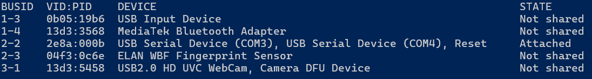
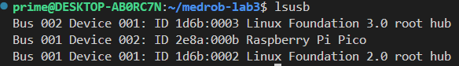
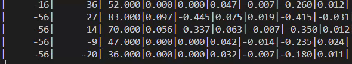

# WN25 ROB599-006 MedRob - Lab-3

## Table of Contents
- [Description](#description)
- [Lab Pre-work: 1.) Linux Setup](#lab-pre-work-1-linux-setup)
- [Lab Pre-work: 2.) Required Software Installation](#lab-pre-work-2-required-software-installation)
- [Lab Pre-work: 3.) Test Build](#lab-pre-work-3-test-build)
- [How to flash the Pico](#how-to-flash-the-pico)
- [Visualize Serial Output](#visualize-serial-output)
- [Plotting(Real-time)](#plotting-real-time)
- [Plotting(Post-process)](#plotting-offline)
- [(Optional) GitHub SSH Setup](/optional_ssh_setup.md)

## Description
This repo is designed for Lab-3 of ROB599-006 Medical Robotics (MedRob) for the University of Michigan WN2025, led by Professors Greg Formosa [(gformosa@umich.edu)](mailto:gformosa@umich.edu) and Mark Draelos [(mdraelos@umich.edu)](mailto:mdraelos@umich.edu). This lab focuses on teleoperation and haptic feedback of a 1-DOF medical robot.
This code, developed by Andy Qin [(andyqin@umich.edu)](mailto:andyqin@umich.edu), is for deployment on the MBot Control Board, utilizing a custom Raspberry Pi Pico microcontroller tailored for the UMich [MBot](https://mbot.robotics.umich.edu/). Much of the base functionality of this code originates from the [Mbot Firmware GitHub Page](https://github.com/mbot-project/mbot_firmware/releases).

For the coding part of this lab, you will only revise [`mbot_teleoperation.c`](/tests/mbot_teleoperation.c) found in the `tests` subfolder. All other firmware can be ignored for control of the 1-DOF device.

There are a few system requirements to work with this lab:
- Linux environment (many will work, we tested on Ubuntu-22.04)
- Git installed (for retrieving updated code)
- CMake installed (for building firmware)
- GCC and G++ compilers
- Your preferred IDE for writing C code
    
Please be sure all of these are installed and working on your laptop before lab, following the directions below.

## Lab Pre-work: 1.) Linux Setup
To use our MBot Pico microcontrollers, we will need to install the [MBot Pico SDK](https://github.com/MBot-Project-Development/pico_sdk), which is Linux-based only. **Therefore, you must be using a Linux environment to work with this lab.**
You are welcomed to use any Linux-based distribution you'd like, whether a native install, dual boot, virtual machine, or [WSL (Windows Subsystem for Linux)](https://learn.microsoft.com/en-us/windows/wsl/install). For simplicity, we provide a WSL setup guide below.

For Mac users, you can explore using **brew** and **Clang**, however if it does not work, you will need to find a Linux or Windows team to work with ( ಠ‿<)

To install WSL on a Windows machine, first open PowerShell or Windows Command Prompt in **administrator** mode, and follow these commands:
```powershell
# To install default Ubuntu distribution
wsl --install

# If that does not work, or to install a specific distribution
wsl --list --online
wsl --install -d <Distribution Name>   # Ubuntu-22.04 will work fine
```

With WSL installed, open an instance of it (find it in the Start menu), and after a fresh install you will need to create a **User Name** and **Password** for your environment. *This account will be considered the Linux administrator, with the ability to run `sudo` administrative commands, so remember your **Password**!*

If you see a terminal like this when you open a PowerShell, you are good to go.
 

## Lab Pre-work: 2.) Required Software Installation
### Git Install, Fork, and Clone
1. First, we recommand forking this repo into your own GitHub account for your own version control. Sign into GitHub with your preferred account, and click "Fork" at the top of this repo.
2. Next, be sure git is installed in your Linux environment, and clone your fork:
    ```bash
    # Check if Git installed locally
    git --version
    # If not
    sudo apt-get install git

    # Then change directories into your desired local folder, and clone this repo:
    git clone https://github.com/<github_username>/medrob-lab3.git
    ```
### Install dependencies via setup.sh
3. After cloning the repository, run the setup script:
    ```bash
    cd ~/medrob-lab3
    ./setup.sh
    ```
   This will install all required dependencies and initialize the submodules, like the Pico SDK. You will likely need to input your Linux sudo password.

    If setup.sh is not executable by default, run the following to enable it:
    ```bash
    sudo chmod +x setup.sh
    ```
### Install CMake
4. Install CMake (at least version 3.13), GCC, and G++ cross-compilers with the commands below:
    ```bash
    sudo apt-get update
    sudo apt install cmake g++ gcc-arm-none-eabi libnewlib-arm-none-eabi libstdc++-arm-none-eabi-newlib
    ```

## Lab Pre-work: 3.) Test Build
You're almost done! Now let's test your system to see if everything was installed correctly, and that you will be able to compile your code and flash your microcontroller during lab.
1. From your 'medrob-lab3' directory, **build** the code as follows:
    ```bash
    mkdir build    # make a build directory, if one doesn't already exist
    cd build       # go into that directory
    cmake ..       # run CMake with the list from the upper level folder
    make           # make the MakeFile to create the firmware
    ```
2. If you see `mbot_teleoperation.uf2` in your `/build/` folder, you've successfully finished pre-lab setup! This file is the firmware that will be flashed onto the microcontroller.

We will give more instruction on how to manipulate the code and flash your microcontrollers during lab.

### IDE Options
You are welcome to use whatever IDE you'd like to write and edit code for this lab, although we suggest [VSCode](https://code.visualstudio.com/download). With the installations from Pre-Work step 2.4, your Linux environment should be good-to-go for compiling the firmware code in C. Again, we will only be revising the [`mbot_teleoperation.c`](/tests/mbot_teleoperation.c) file found in the `tests` subfolder.

#### For Linux users with a OS GUI:
(e.g., native install, dual boot, virtual machine)
You can open and edit the `mbot_teleoperation.c` in your preferred IDE, and build/make the firmware through a terminal. You may need to install C/C++ extensions for your IDE for easier coding.


#### For WSL Users:
Don't worry, you won't have to use the WSL terminal window again! First, install [VSCode](https://code.visualstudio.com/download) and make sure the WSL extension is installed. Then, connect to WSL (to do this you can press 'F1', type "WSL", and click the option that says "WSL: Connect to WSL in a New Window"). Now you can open a local Linux folder in VSCode that has all your Git files, and you can build/make them through a VSCode terminal.

**Side note:** Because WSL is a literal subsystem of the Linux environment on your Windows OS, you can directly access any of your Linux files through your file explorer. With WSL running, on the left-hand column of your Windows File Explorer, you should now see a "Linux" branch (usually beneath "This PC" and "Network") that you can navigate through. Or, you should be able to paste this path into any file explorer to get to your WSL home directory: `\\wsl.localhost\Ubuntu-22.04\home\<Linux username>\`.
__________________________________
## How to flash the Pico
Each time you change your code and wish to "push" to the Pico board, you need to flash the Pico with the new program manually. Refer to the Manually Flashing Firmware section [here](https://mbot.robotics.umich.edu/docs/setup/firmware/#manually-flashing-firmware).
1. Put the Pico into BOOSTEL mode
    - Locate the “BOOTSEL” and “RST” buttons on the board (short for “Boot Select” and “Reset”).
    - Hold down both “RST” and “BOOTSEL”
    - Release “RST” then “BOOTSEL” to put the board into flashing mode.
    
2. The Pico should now show up as a device in the file explorer as a USB device. Open the USB device in the file explorer.
3. Drag and drop the firmware you want to flash (for this lab it will only be `/build/mbot_teleoperation.uf2`) into the folder. The Pico will reboot automatically, and will then run the script you flashed.

## Visualize Serial Output

1. Open PowerShell in **administrator** mode and install `usbipd`. Refer to [Microsoft's Official USB Connection](https://learn.microsoft.com/en-us/windows/wsl/connect-usb) for more info.
    ```powershell
    winget install --interactive --exact dorssel.usbipd-win
    ```
2. Follow the [instructions](https://learn.microsoft.com/en-us/windows/wsl/connect-usb#attach-a-usb-device) until Step 4.
    ```powershell
    # In PowerShell:
    # List all USB devices
    usbipd list
    # Share device permission to be attached to WSL
    usbipd bind --busid <BUSID>
    # Attach device to WSL
    usbipd attach --wsl --busid <BUSID>

    # In WSL, see if device attached
    lsusb
    ```
    You should see USB Serial Device **attached** in PowerShell

    

    You should see Pico listed in WSL when you complete.
    
    
3. Use `screen`

    ```
    sudo screen /dev/ttyACM0 115200
    ```
    Exit `screen`: To exit the serial monitor in screen, press `Ctrl + A`, then `K` to kill the session, or `Ctrl + A`, then `D` to detach.
4. Or use `minicom`
    ```
    sudo minicom -s
    ```

    - Go to Serial port setup and set the Serial device (e.g., /dev/ttyACM0 or /dev/ttyUSB0).
    - Set the baud rate (e.g., 115200), data bits (8), parity (None), and stop bits (1).
    
    Exit `minicom`: To exit, press `Ctrl + A`, then `Z` for help, and then `X` to quit.
5. You should see serial output from terminal like this. Each line represents the current state of the system including motor positions and command values. Refer to `tests/mbot_teleoperation.c` for more details.

    

## Plotting (Real-time)
Real-time plotting should be smooth in Linux but may experience delay in WSL due to X forwarding. Python and pip need to be installed. It is recommended to create a virtual environment.
```bash
pip install -r requirements.txt
python python/realtime_plot.py
```

For WSL users, WSL itself does not have a built-in X server, so you need to install a separate X server application on your Windows system to use X forwarding. Consider installing [VcXsrv](https://vcxsrv.com/).
```bash
export DISPLAY=:0
```

## Plotting (Offline)
If real-time plotting is not working smoothly, you can choose to record and save the serial output data into a csv file and visualize afterwards.

```bash
python python/record_plot.py
```

## (Optional) GitHub SSH Setup

SSH is recommended if you wish to maintain your own repo for this project and do your own version control. This can be especially helpful when working with your teammates with multiple branches. 

Follow the [instructions here](/optional_ssh_setup.md) to get this setup.

