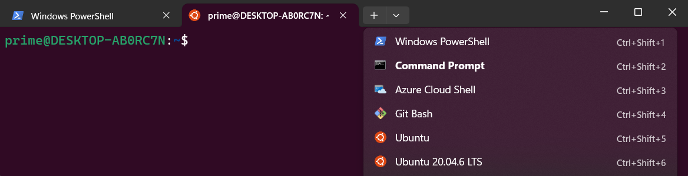

# WN25 ROB599 MedRob Lab3

## Table of Content

- [Description](#description)
- [Linux Setup](#linux-setup)
- [Installation](#installation)
- [(Optional) GitHub SSH Setup](/optional_ssh_setup.md)

## Description
This repo is designed for Lab 3 of ROB599 Medical Robotics, WN2025 University of Michigan. It is to be deployed on the Raspberry Pi Pico tailored specifically for MBot, some originates from [Mbot Firmware GitHub Page](https://github.com/mbot-project/mbot_firmware/releases)

For the coding part of this lab, you should only revise [`mbot_teleoperation.c`](/tests/mbot_teleoperation.c)

## Linux Setup
The [MBot Pico SDK](https://github.com/MBot-Project-Development/pico_sdk) is simplified, and Linux-based only. You are welcomed to use any Linux-based distribution or methods such as a virtual machine or dual boot. However, for simplicity, we provide a WSL setup guide here. Refer to [Microsoft's Official WSL Installation](https://learn.microsoft.com/en-us/windows/wsl/install) for more info. 

For Mac users, you can explore using **brew** and **Clang**, or please find a Windows teammate ( ಠ‿<)

Open PowerShell or Windows Command Prompt in **administrator** mode
```powershell
# To install default Ubuntu distribution
wsl --install

# To check all available distributions and install a specific one
wsl --list --online
wsl --install -d <Distribution Name> # It's tested on Ubuntu-22.04
```
Then open the distribution using the Start menu. You will be asked to create a **User Name** and **Password** for your Linux distribution. This account will be considered the Linux administrator, with the ability to run `sudo` administrative commands, so remember your **Password**!

If you see something like this when you open a PowerShell, you are good to go.

 

## Installation
1. We recommand forking this repo into your own GitHub account for your own version control
    ```bash
    # Check if Git installed locally
    git --version
    # If not
    sudo apt-get install git

    # Then clone this repo in your desired local folder
    git clone https://github.com/<github_username>/medrob-lab3.git
    ```

1. After cloning the repository, run the setup script:
    ```bash
    cd ~/medrob-lab3
    ./setup.sh
    ```
    - which will install dependencies (requires sudo password) and initialize the submodules.

    If setup.sh is not executable by default, run the following to enable it:

    ```bash
    sudo chmod +x setup.sh
    ```
2. Install CMake (at least version 3.13), and GCC cross compiler
    ```bash
    sudo apt-get update
    sudo apt install cmake gcc-arm-none-eabi libnewlib-arm-none-eabi libstdc++-arm-none-eabi-newlib
    ```
3. Build as follows:
    ```bash
    mkdir build
    cd build
    cmake ..
    make
    ```
4. If you see `mbot_teleoperation.uf2` in your `/build/` folder, you've finished pre-lab setup.
__________________________________